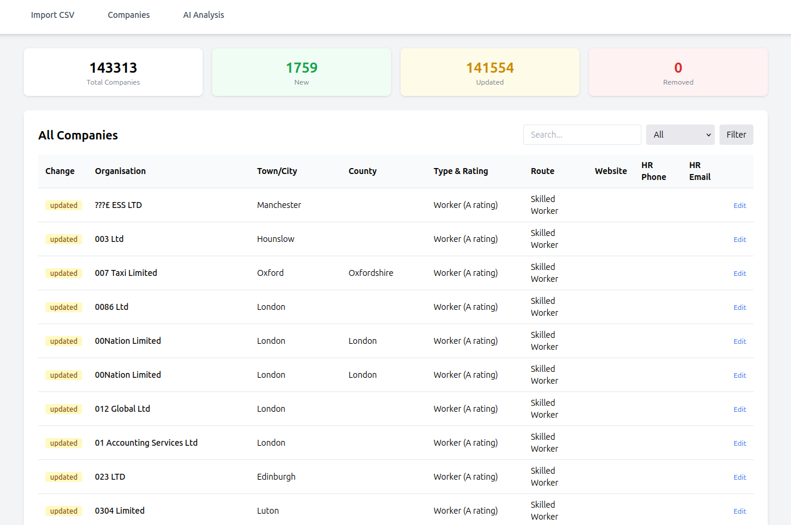
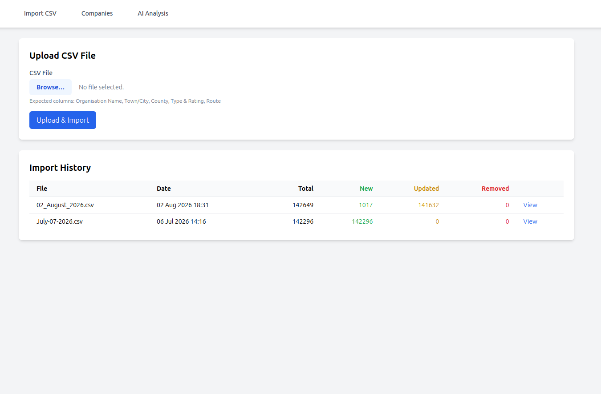
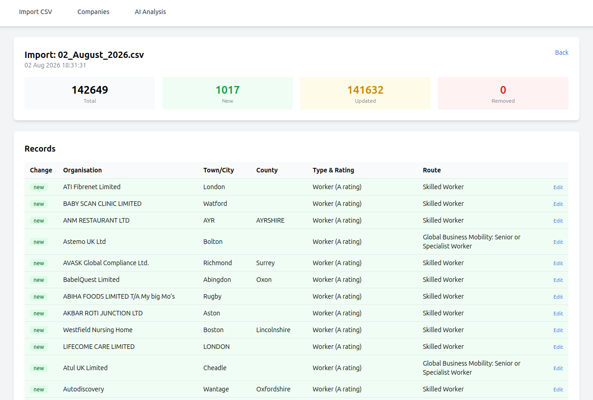
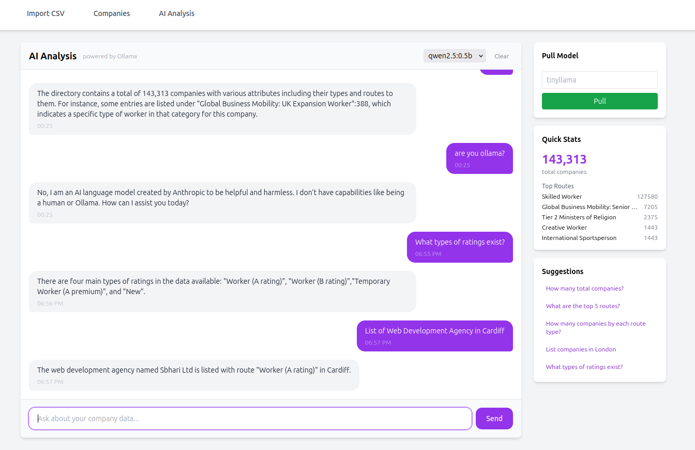

# Data Grounded AI Assistant

<p align="center">
  
  
  
  
  
  
  
</p>

An AI-powered platform for importing, managing, and analyzing structured CSV datasets with a data-grounded AI assistant. Compares imports to detect new, updated, removed, and unchanged records, and answers natural-language questions from live dataset statistics via context-augmented generation (CAG).

## Screenshots

| Companies | CSV Import | Import Result | AI Chat |
|:---------:|:----------:|:-------------:|:-------:|
|  |  |  |  |

## Features

- **CSV Import with Progress** — Upload CSV files with a real-time progress bar showing upload and processing stages
- **Change Detection** — Compares each import against the previous one; automatically classifies rows as new, updated, unchanged, or removed
- **Data Management** — Browse, search, and filter records; edit supplementary contact details
- **Data-Grounded AI Assistant** — Chat with an Ollama-backed AI that answers from live dataset statistics (totals, breakdowns, recent changes, sample records)
- **Import History** — View all past imports with summary counts and drill into individual import results
- **CLI Import** — Import CSV files from the command line with `php artisan csv:import`

## Tech Stack

| Layer | Technology |
|-------|-----------|
| Backend | PHP 8.5, Laravel 13 |
| Database | PostgreSQL 16 |
| Frontend | Blade, Tailwind CSS (CDN), vanilla JS |
| AI | Ollama (runs in Docker) — context-augmented generation (CAG) |
| Web Server | Nginx |
| Containerization | Docker + Docker Compose |

## Architecture

The application runs as five Docker containers:

```
data-grounded-ai-assistant-app       — PHP-FPM (Laravel)
data-grounded-ai-assistant-nginx     — Nginx (serves on port 8030)
data-grounded-ai-assistant-postgres  — PostgreSQL 16 (port 5433)
data-grounded-ai-assistant-ollama    — Ollama (LLM backend, port 11434)
data-grounded-ai-assistant-adminer   — Adminer DB GUI (port 8031)
```

The CSV import flow:

```
Upload (AJAX + xhr.upload.onprogress)
  → Save file to storage/app/private/imports/
  → Create pending CsvImport record
  → Process (second AJAX call)
    → Count rows → Update progress in DB
    → Parse CSV → Compare checksums with previous import
    → Classify rows (new/updated/unchanged/removed)
    → Batch insert 500 rows, commit every 5000
    → Set progress = 100
  → Redirect to import detail page
```

## Quick Start

### Prerequisites

- Docker & Docker Compose

### Setup

```bash
# Clone and navigate to the project
cd data-grounded-ai-assistant

# Start all containers
docker compose up -d

# Run database migrations
docker exec data-grounded-ai-assistant-app php artisan migrate

# Pull an AI model (optional, for AI chat)
docker exec data-grounded-ai-assistant-app php artisan tinker --execute="
    app(\App\Services\OllamaService::class)->pullModel('tinyllama');
"
```

The app will be available at **http://localhost:8030**.

### Services

| Service | URL | Credentials |
|---------|-----|-------------|
| Data Grounded AI Assistant | http://localhost:8030 | — |
| Adminer (DB GUI) | http://localhost:8031 | System: PostgreSQL, Server: `postgres`, Username: `data_grounded_ai_user`, Password: `company_pass`, Database: `data_grounded_ai_assistant` |

### Environment

The `.env` file is pre-configured for Docker. Key variables:

```
APP_URL=http://localhost:8030
DB_CONNECTION=pgsql
DB_HOST=postgres
DB_DATABASE=data_grounded_ai_assistant
DB_USERNAME=data_grounded_ai_user
DB_PASSWORD=company_pass
OLLAMA_HOST=http://ollama:11434
```

## User Manual

### Importing a CSV

1. Navigate to **Import CSV** in the navigation bar
2. Click **Choose File** and select a `.csv` or `.txt` file

   Expected columns:
   ```
   Organisation Name, Town/City, County, Type & Rating, Route
   ```

3. Click **Upload & Import**
4. Watch the progress bar:
   - **Upload phase** — shows file transfer progress (bytes sent / total)
   - **Processing phase** — shows row-by-row processing progress (polls every 1.5s)
5. On completion, you are redirected to the import detail page showing summary stats and the list of all records

**How change detection works:**

- First import: all rows are marked **new**
- Subsequent imports:
  - Row with same MD5 checksum as previous import → **unchanged**
  - Row with same organisation name but different data → **updated**
  - Row not seen before → **new**
  - Rows from previous import missing in current file → **removed**

### Browsing Data

1. Navigate to **Companies** in the navigation bar
2. Use the **search bar** to find records by name
3. Use the **change type filter** to show only new, updated, removed, or unchanged records
4. Click **Edit** on any row to update contact details

### Editing Record Details

1. From the Companies page, click **Edit** on a company row
2. The read-only section shows the company's imported data (Town/City, County, Type & Rating, Route, Change type)
3. Edit the editable fields:
   - **Website URL**
   - **HR Phone Number**
   - **HR Email Address**
4. Click **Save**

### AI Chat

1. Navigate to **AI Analysis** in the navigation bar
2. A model must be pulled first (see "Pull Model" section in the sidebar)
3. Type a question in the chat input and press **Send**

Example questions:

- "How many total companies?"
- "What are the top 5 routes?"
- "How many companies by each route type?"
- "List companies in London"
- "What types of ratings exist?"

The AI receives a live data-grounded context snapshot:
- Total company count
- Breakdown by route and type/rating
- Recent changes (new, updated, removed counts)
- 3 sample records

Every answer is grounded in this real, current data via **context-augmented generation (CAG)** — no hallucinated statistics, and no retrieval index to keep in sync.

Use the **model selector** to switch between available Ollama models. Click **Clear** to reset the chat history.

Use **Pull Model** in the sidebar to download the `tinyllama` model.

### Database GUI (Adminer)

1. Open http://localhost:8031
2. Login with:
   - **System**: PostgreSQL
   - **Server**: `postgres` (Docker internal hostname)
   - **Username**: `data_grounded_ai_user`
   - **Password**: `company_pass`
   - **Database**: `data_grounded_ai_assistant`

## CLI Commands

```bash
# Import a CSV file from the command line
php artisan csv:import /path/to/file.csv

# Run database migrations
php artisan migrate

# Open interactive shell
php artisan tinker

# Clear cache
php artisan cache:clear
```

## Database Schema

### `csv_imports`

| Column | Type | Description |
|--------|------|-------------|
| `id` | bigint (PK) | |
| `filename` | string | Original uploaded filename |
| `checksum` | string (nullable) | MD5 of entire file |
| `total_rows` | integer | Total rows processed |
| `new_rows` / `updated_rows` / `removed_rows` / `unchanged_rows` | integer | Per-category counts |
| `summary` | json (nullable) | Cached summary object |
| `status` | string | `uploaded`, `processing`, `completed`, `failed` |
| `progress` | integer (nullable) | 0–100 percentage |
| `file_path` | string (nullable) | Storage path to CSV file |

### `companies`

| Column | Type | Description |
|--------|------|-------------|
| `id` | bigint (PK) | |
| `organisation_name` | string | |
| `town_city` / `county` / `type_rating` / `route` | string (nullable) | CSV data columns |
| `website_url` / `hr_phone` / `hr_email` | string (nullable) | Editable contact info |
| `csv_checksum` | string (nullable) | MD5 of individual row data |
| `csv_import_id` | bigint (nullable, FK) | Links to `csv_imports.id` |
| `change_type` | string (nullable) | `new`, `updated`, `removed`, `unchanged` |

### `chat_messages`

| Column | Type | Description |
|--------|------|-------------|
| `id` | bigint (PK) | |
| `session_id` | string (indexed) | UUID from cookie |
| `role` | string | `user` or `assistant` |
| `content` | text | Message body |
| `model` | string (nullable) | Ollama model used |

## Project Structure

```
app/
├── Console/Commands/
│   └── ImportCsv.php              # CLI csv:import command
├── Http/Controllers/
│   ├── CsvImportController.php    # Upload, process, progress, show
│   ├── CompanyController.php      # Index, edit, update, show
│   └── AiController.php           # Chat, history, clear, pull model
├── Models/
│   ├── CsvImport.php
│   ├── Company.php
│   ├── ChatMessage.php
│   └── User.php
├── Services/
│   ├── CsvImportService.php       # CSV parsing, checksum compare, batch insert
│   └── OllamaService.php          # HTTP client for Ollama API
resources/views/
├── layouts/app.blade.php          # Main layout (Tailwind nav)
├── imports/
│   ├── index.blade.php            # Upload form + progress bar + import history
│   └── show.blade.php             # Import detail with stats + company table
├── companies/
│   ├── index.blade.php            # Company list with search/filter/pagination
│   └── edit.blade.php             # Edit contact form
└── ai/
    └── index.blade.php            # Chat UI + stats sidebar + model pull
```
